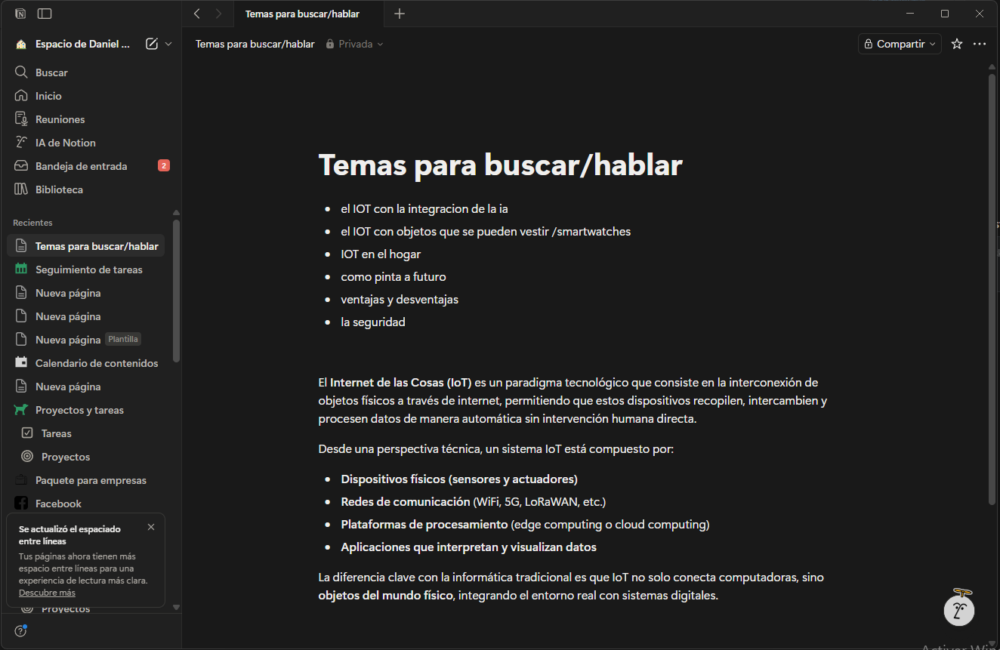

<div align="center">
  
  <h1>Budget Manager</h1>
  <p>Aplicación de escritorio para gestión de presupuesto personal, con tipos de cambio en tiempo real.</p>

  
  
  
  
  
</div>

---

## 📋 Índice

- [Vista previa](#-vista-previa)
- [Características](#-características)
- [Tecnologías](#-tecnologías)
- [Uso de la app](#-uso-de-la-app)
- [Instalación para desarrollo](#-instalación-para-desarrollo)
- [Compilar el ejecutable](#-compilar-el-ejecutable)
- [Estructura del proyecto](#-estructura-del-proyecto)
- [Variables de entorno](#-variables-de-entorno)

---

## 🖥 Vista previa

> Dark mode · Sidebar de navegación · Cards de métricas · Donut chart · Tabla de gastos



---

## ✨ Características

| Módulo | Descripción |
|---|---|
| 📊 **Dashboard** | Métricas KPI (presupuesto, gastado, saldo, % consumido) + gráfica donut por categoría |
| 💸 **Gastos** | CRUD completo con validaciones en tiempo real y búsqueda por concepto/categoría |
| 💱 **Tipo de Cambio** | Tasas en tiempo real vía ExchangeRate-API · Convertidor de monedas · Caché de 1 hora |
| 📈 **Reportes** | Tabla de todos los gastos · Exportación a PDF y CSV |
| ⚙️ **Configuración** | Presupuesto base · Moneda global · Categorías personalizadas |
| 🔒 **Seguridad** | API key nunca expuesta al renderer — todas las llamadas van por el proceso principal de Electron |
| 📐 **Responsive** | Layout fluido de 1024×768 a 2560×1440, soporta zoom entre 75% y 150% |

---

## 🛠 Tecnologías

- **Electron 29** — Shell de escritorio nativo para Windows
- **React 18** + **Vite 5** — UI reactiva con hot-reload en desarrollo
- **SQLite** via `sql.js` — Base de datos local embebida (sin instalación externa)
- **Recharts** — Gráfica donut responsive
- **Zustand** — Gestión de estado global
- **jsPDF** + **jspdf-autotable** — Generación de reportes PDF
- **Lucide React** — Iconografía minimalista

---

## 🚀 Uso de la app

### Opción A · Ejecutable portable (sin instalar nada)

1. Descarga el archivo `BudgetManager-con-logo.zip`
2. Descomprímelo en cualquier carpeta
3. Ejecuta `Budget Manager.exe`
4. ¡Listo! Todos tus datos se guardan localmente en `budget.db` junto al ejecutable

> ⚠️ No muevas el `.exe` fuera de la carpeta descomprimida. Los archivos adjuntos son necesarios para que funcione.

---

### Guía rápida de uso

#### 1️⃣ Configurar tu presupuesto

Ve a **Configuración** → ingresa tu presupuesto mensual total → selecciona tu moneda → guarda.

#### 2️⃣ Crear categorías

En **Configuración** → sección *Categorías* → dale un nombre y color → agregar.  
Ejemplos: `Vivienda`, `Alimentación`, `Transporte`, `Entretenimiento`.

#### 3️⃣ Registrar gastos

Ve a **Gastos** → clic en **Agregar gasto** → completa:
- **Concepto**: nombre del gasto (ej. "Renta mensual")
- **Categoría**: selecciona una de las creadas
- **Monto**: el valor — verás en tiempo real qué % representa sobre tu presupuesto

#### 4️⃣ Ver el Dashboard

El **Dashboard** se actualiza automáticamente con:
- 💰 Total presupuestado vs. gastado
- 📉 Saldo disponible con alerta si lo excedes
- 🍩 Gráfica de dona por categoría

#### 5️⃣ Tipo de cambio

Ve a **Tipo de Cambio** para:
- Consultar tasas actualizadas respecto a cualquier moneda base
- Convertir montos al instante entre dos monedas
- Ver la fecha de la última actualización (caché de 1 hora)

#### 6️⃣ Exportar reporte

Ve a **Reportes** → clic en **Exportar PDF** o **Exportar CSV** para guardar un resumen de tus gastos.

---

## 💻 Instalación para desarrollo

### Requisitos previos

- [Node.js 18+](https://nodejs.org)
- npm 9+

### Pasos

```bash
# 1. Clona el repositorio
git clone https://github.com/TU_USUARIO/gastosRatto.git
cd gastosRatto

# 2. Instala las dependencias
npm install

# 3. Crea el archivo de variables de entorno
cp .env.example .env
# Edita .env y agrega tu API key de ExchangeRate-API

# 4. Inicia en modo desarrollo (Vite + Electron simultáneamente)
npm run dev
```

> La app abrirá automáticamente la ventana de Electron apuntando a `http://localhost:5173`.  
> Las DevTools se abren en modo detached para depurar el renderer.

---

## 📦 Compilar el ejecutable

```bash
# Genera el bundle de producción y empaqueta como .zip portable para Windows x64
npm run dist
```

El resultado se genera en `dist-electron/Budget Manager-1.0.0-win.zip`.

> ℹ️ Si ves un error de **permisos de symlinks**, ejecuta el comando como Administrador  
> o activa el **Modo de programador** en Configuración → Para desarrolladores.

---

## 📁 Estructura del proyecto

```
gastosRatto/
├── assets/               # Icono de la app (.ico para el .exe)
├── electron/
│   ├── main.js           # Proceso principal: ventana, IPC handlers
│   ├── preload.js        # Bridge seguro renderer ↔ main
│   ├── database/
│   │   ├── db.js         # Inicialización de SQLite
│   │   └── queries.js    # Todas las operaciones SQL
│   └── services/
│       └── exchangeService.js  # Llamadas a ExchangeRate-API + caché
├── public/
│   └── logo.png          # Logo visible en la interfaz web
├── src/
│   ├── components/
│   │   ├── charts/       # DonutChart (Recharts)
│   │   ├── common/       # Card, Button, Input, Modal, Badge…
│   │   └── layout/       # TitleBar, Sidebar
│   ├── pages/            # Dashboard, Gastos, TipoDeCambio, Reportes, Configuracion
│   ├── services/         # budgetService.js (wrapper IPC → renderer)
│   ├── store/            # budgetStore.js, exchangeStore.js (Zustand)
│   ├── tokens/           # design.js — tokens de color y diseño
│   ├── utils/            # format.js, currencies.js
│   ├── App.jsx
│   ├── main.jsx
│   └── index.css         # Sistema de diseño global (design system)
├── .env                  # Variables de entorno locales (no se sube a Git)
├── .gitignore
├── .gitattributes
├── package.json
├── vite.config.js
└── README.md
```

---

## 🔑 Variables de entorno

Crea un archivo `.env` en la raíz del proyecto con el siguiente contenido:

```env
# API key de ExchangeRate-API (https://www.exchangerate-api.com)
# Plan gratuito: 1,500 peticiones/mes
EXCHANGE_API_KEY=tu_api_key_aqui
```

> La API key **nunca** llega al renderer de Electron. Solo el proceso principal (`electron/services/exchangeService.js`) la consume, siguiendo RNF-07.

---

## 📄 Licencia

MIT © 2024 — Budget Manager
